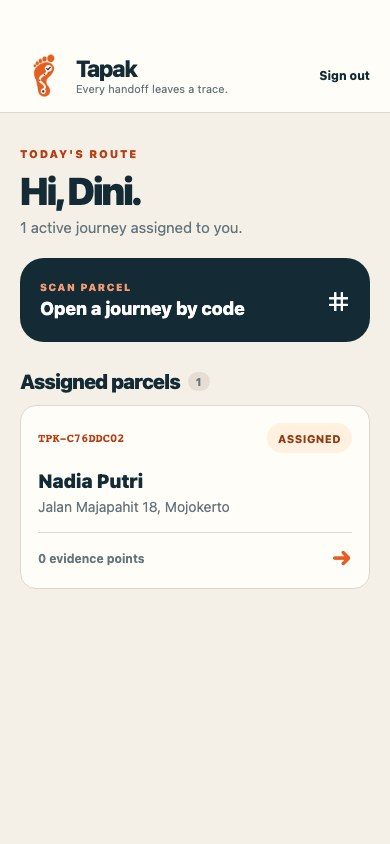
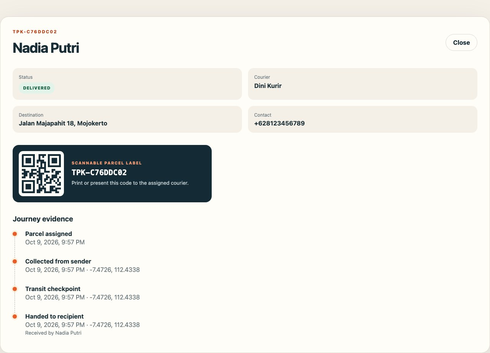
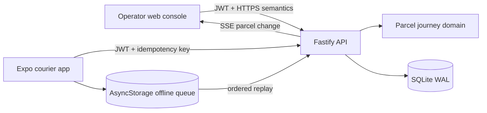

# Tapak

[](https://github.com/abiekaputra/tapak/actions/workflows/ci.yml)
[](https://github.com/abiekaputra/tapak/actions/workflows/secret-scan.yml)

<p align="center">
  
</p>

**A courier loses signal halfway through a route. The parcel should not lose its history.**

Tapak is a local parcel journey and proof-of-delivery product. An operator creates a
shipment and prints its QR label; the assigned courier scans it in an Expo mobile app,
records location-backed handoffs, and can continue while offline. Each queued event keeps
one idempotency identity, so reconnecting adds the evidence once rather than rewriting the
journey.

This repository contains the complete local portfolio release. It has no public deployment,
carrier integration, or claim of legal identity verification.



## The journey

1. An operator creates a parcel and assigns the local courier account.
2. Tapak produces a QR label containing the public parcel code.
3. The courier scans the label or enters its code manually.
4. Pickup, transit, and delivery events capture time and device coordinates.
5. Events recorded without connectivity stay in a local queue and appear immediately in
   the courier timeline.
6. Reconnection replays events in order with their original idempotency keys.
7. The operator receives the updated journey through the live stream or bounded polling
   fallback and can inspect the final recipient proof.



## Product surfaces

| Surface                  | User         | Delivered behavior                                                                                     |
| ------------------------ | ------------ | ------------------------------------------------------------------------------------------------------ |
| Expo mobile application  | Courier      | Assigned route, camera scan, manual lookup, geolocation evidence, offline queue, retry, delivery proof |
| React operations console | Operator     | Parcel creation, courier assignment, QR label, live status board, complete journey timeline            |
| Fastify API              | Both clients | Authentication, role authorization, validation, idempotent event writes, audit records, SSE updates    |

## Architecture



The release uses a modular TypeScript monorepo. `contracts` owns wire validation, `domain`
owns legal state transitions, and each product surface owns only its presentation and
transport concerns. SQLite keeps the local setup small while preserving relational
transactions, unique idempotency keys, foreign keys, and indexed courier queries.

See [system architecture](docs/architecture.md) and [engineering decisions](docs/engineering-decisions.md).

## Technology choices

| Technology                 | Reason                                                                                                                    |
| -------------------------- | ------------------------------------------------------------------------------------------------------------------------- |
| Expo SDK 57 + React Native | Expo Go validation, camera and location support, and one courier screen tree across Android, iOS bundles, and web preview |
| React + Vite               | A focused desktop operations console with a small production bundle                                                       |
| Fastify + Zod              | Typed HTTP boundaries, explicit validation, and low local runtime overhead                                                |
| Node SQLite                | Durable transactions without a separate database service for a local portfolio release                                    |
| AsyncStorage + NetInfo     | Durable mobile queue and connectivity-triggered replay                                                                    |
| Playwright + Vitest        | Browser journey evidence plus isolated domain and API failure tests                                                       |

## Local setup

### Prerequisites

- Node.js 24
- pnpm 11
- Expo Go compatible with Expo SDK 57
- A phone and computer on the same local network for physical-device validation

```bash
git clone https://github.com/abiekaputra/tapak.git
cd tapak
pnpm install
pnpm setup:local
```

`setup:local` creates private local passwords, the JWT secret, and the computer's LAN API
address. It writes the credentials to `runtime/local-credentials.txt`; both files are ignored
by Git.

Start the API and operator console:

```bash
pnpm dev
```

Open `http://127.0.0.1:4173`, then start Expo in another terminal:

```bash
pnpm dev:mobile
```

Scan the terminal QR code with Expo Go. If the phone cannot reach the API, confirm both
devices share one network and that `apps/mobile/.env.local` contains the computer's current
LAN address. Full instructions are in [the Expo Go guide](docs/expo-go.md).

## Quality gates

```bash
pnpm quality
pnpm test:e2e
```

The release verifies Prettier, the 300-line production limit, Oxlint, strict TypeScript,
domain tests, API integration tests, web production build, Android/iOS/web Expo bundles, and
the complete operator-to-courier browser journey. The browser journey deliberately records
pickup offline before reconnecting and finishing delivery.

## Repository map

```text
apps/api        Fastify application, SQLite repository, authentication, and routes
apps/mobile     Expo courier application, device integration, cache, and offline queue
apps/web        React operations console and live journey presentation
packages/contracts  Shared Zod request and response contracts
packages/domain     Parcel state machine and domain failures
tests/e2e       End-user operator and courier journey
docs            Product, security, API, architecture, and validation evidence
```

## Security and product boundaries

Passwords are scrypt hashed, JWT secrets and seed passwords come from ignored environment
files, role checks run on the server, inputs are parsed with Zod, and idempotency keys are
unique at the database boundary. Logs redact authorization headers and never include parcel
contact values. See [SECURITY.md](SECURITY.md) for the local release threat model.

Tapak uses synthetic recipients and coordinates in tests and screenshots. Public hosting,
real carrier data, background native geofencing, signatures or photographs, multi-tenant
organizations, route optimization, and legal delivery certification remain outside this
release.

## License

[MIT](LICENSE)
