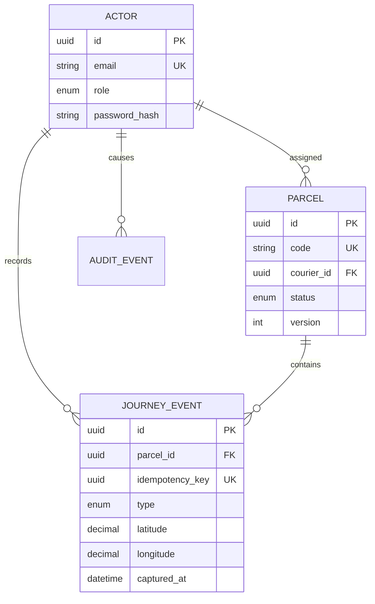

# System architecture

## Boundaries

Tapak is a modular monorepo with two user interfaces and one local API. Shared packages keep
transport shapes and state rules independent from React, Expo, Fastify, and SQLite.

| Boundary             | Responsibility                                                                           |
| -------------------- | ---------------------------------------------------------------------------------------- |
| `packages/contracts` | Zod schemas and shared response types                                                    |
| `packages/domain`    | Valid parcel transitions and domain errors                                               |
| `apps/api`           | Authentication, authorization, transactions, persistence, audits, and live change events |
| `apps/mobile`        | Courier navigation, camera, location, local cache, offline queue, and synchronization    |
| `apps/web`           | Operator assignment, QR labels, status board, and evidence inspection                    |

## Data model

## Offline synchronization

Each event receives its UUID before the network attempt. A network failure stores the same
payload in AsyncStorage and applies its domain transition to the cached parcel. NetInfo starts
ordered replay after reconnection. The database unique constraint makes retries converge on a
single event even if the client lost the first successful response.

The queue retains failed entries instead of dropping them. A successful replay reloads the
server representation, removing optimistic timestamps and replacing them with the persisted
journey.

## Live operator updates

The API publishes a parcel identifier after each committed mutation. The web console consumes
the authenticated SSE stream and refreshes its scoped list. A ten-second polling fallback
recovers from proxies or browser conditions that interrupt streaming.

## Transaction boundary

Journey insertion, parcel state/version update, and audit insertion share one `BEGIN IMMEDIATE`
SQLite transaction. The operator never sees a status without its evidence row or an event
without its audit record.
